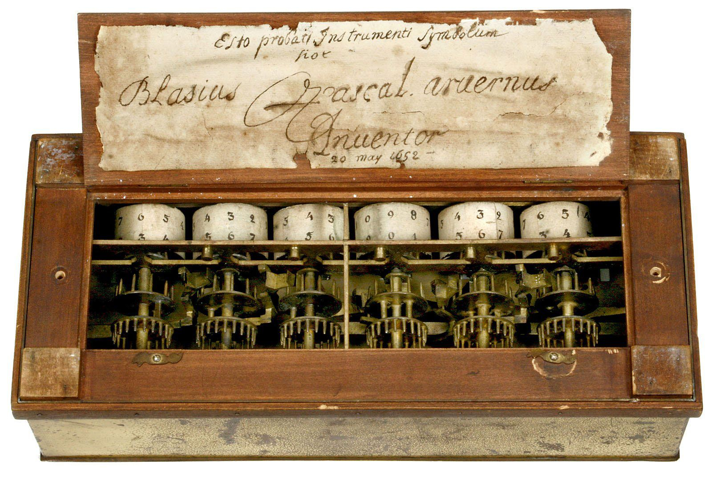
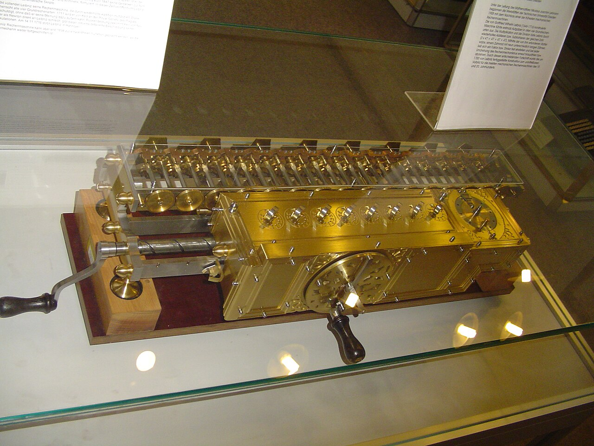
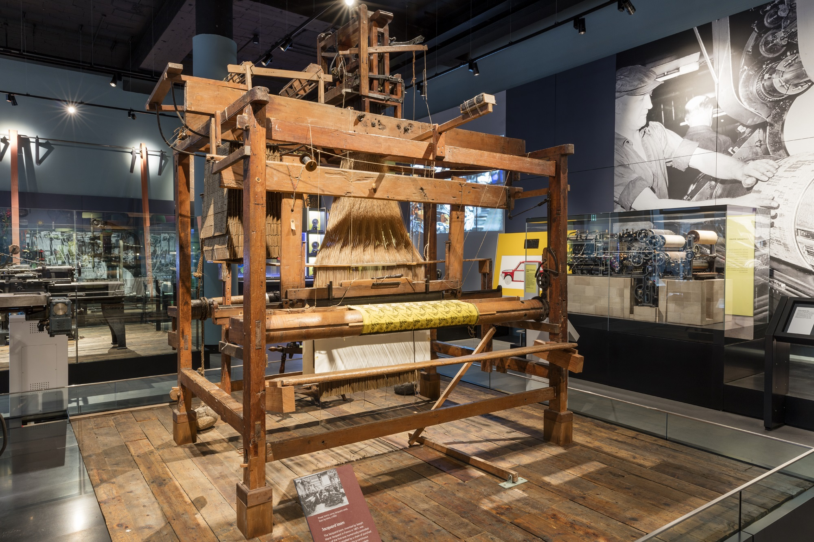
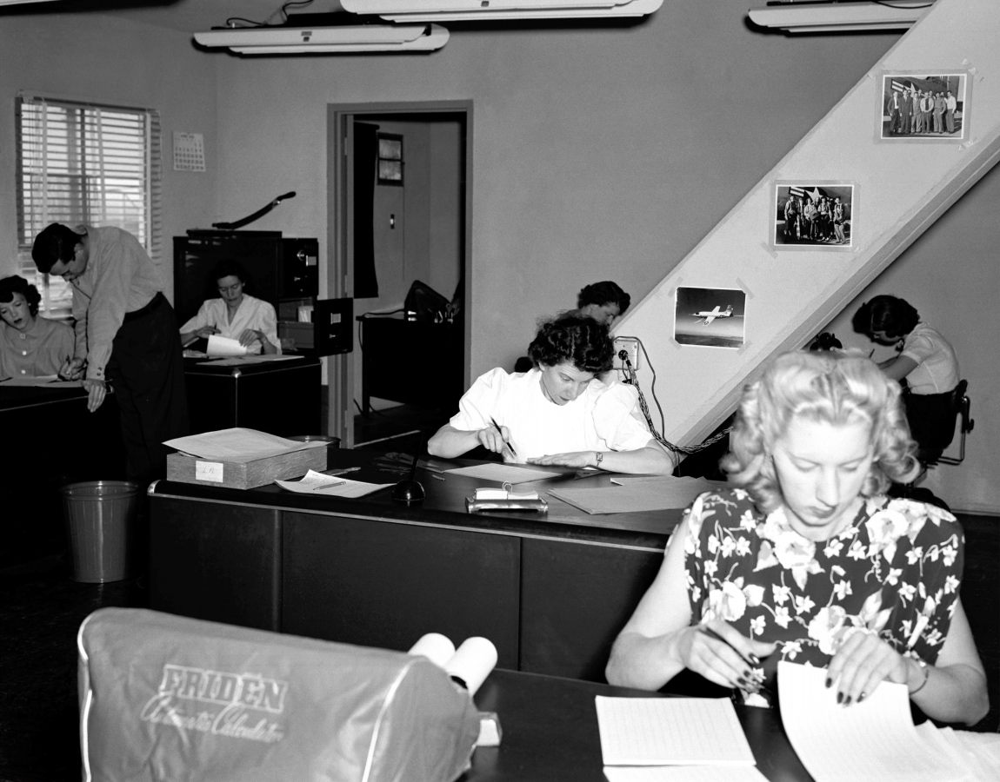
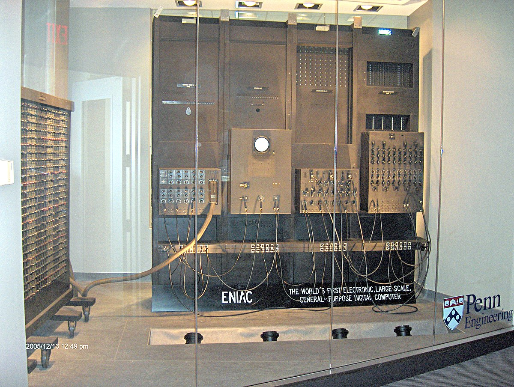

!!! info "Introducción"
	
    Para comprender el alcance de la IA en Educación Superior necesitamos comprender las bases de la computación tradicional, de internet y lo que hoy llamamos plataformas. Comencemos entonces con la computadora.

## Calculadoras

Si quisiéramos rastrear ciertos antecedentes tecnológicos de las computadoras tenemos que remontarnos a las primeras máquinas para realizar cuentas y operaciones matemáticas de manera mecánica/automática.

> Una de las primeras máquinas de este tipo fue la [pascalina](https://es.wikipedia.org/wiki/Pascalina), diseñada por el filósofo Blas Pascal en 1642. 

La pascalina era una máquina compuesta de engranajes que permitían realizar sumas y restas . Dado que algunas ruedas dentadas operaban como unidades, otras como decenas y otras como centenas, se obtenían distintas cifras según su posición. 

Pocos años después el alemán Gottfried Leibniz, otro filósofo y matemático, sumó a este sistema un elemento revolucionario: un cilindro metálico de dientes irregulares, conocido como "la rueda de Leibniz", y que siguió utilizándose en máquinas de calcular hasta entrado el siglo XX.

## Máquinas programables

Pero una calculadora, en sentido estricto, no es un buen antecedente, ya que solo puede realizar un conjunto de operaciones muy limitado. Una computadora en cambio, es esencialmente una máquina que puede se "programar" para realizar muchos tipos de operaciones.

En este sentido, la primera máquina programable fue un telar diseñado por Joseph-Marie Jacquard el hijo de un hilandero que en pleno siglo XVIII inventó un telar automático. En el telar de Jacquard se podían introducir unas tablitas de cartón con agujeros cuyo orden establecía el patrón con el que subían y bajaban las agujas.

> Imagen: Museo Nacional de Escocia

Si se quería cambiar el diseño del tejido, se debían cambiar las tablillas de instrucciones (por otras con agujeros distribuidos de manera diferente); en otras palabras, se instalaba otro programa.

## Calculadoras programables

Charles Babbage fué un matemático londinense que a comienzos del 1800 desarrolló una máquina mucho más compleja y versátil que la Pascalina que llamó el “motor analítico”, y que sentó las bases de la computadora programable. Para su diseño, Babbage se inspiró en los telares de Jacquard y propuso proveer a la máquina con una pila de tarjetas perforadas cuya función fuera establecer el programa que la máquina ejecutaría.

En 1833, durante una fiesta en Londres, Charles Babbage se encuentra con Ada Lovelace, una joven curiosa que desarrollaría un lenguaje matemático a través de las tarjetas perforadas que permitía darle instrucciones a la máquina de Babbage para que elabore de manera automática números de Bernoulli. De esta forma, Ada Lovelace se convierte en la primera programadora de la historia.

<iframe width="100%" height="440" src="https://www.youtube.com/embed/wqZOH8T-LRo" title="YouTube video player" frameborder="0" allow="accelerometer; autoplay; clipboard-write; encrypted-media; gyroscope; picture-in-picture; web-share" referrerpolicy="strict-origin-when-cross-origin" allowfullscreen></iframe>

## Computadoras humanas

Hasta el momento hemos hablado de máquinas y calculadoras, pero ¿de dónde viene la palabra *computadora*? Hasta hace no mucho tiempo, cuando uno decía computadora hacía referencia a una **profesión**, normalmente ocupada por mujeres.

Estas computadoras humanas, eran profesionales de la matemática y el cálculo complejo. Y si bien puede parecer una reivindicación de la mujer en la historia, una lectura desde el tecnofeminismo advierte sobre el rol asignado a la mujer en tareas repetitivas y dificultosas que no quieren ser asumidas por los hombres, que guardan para sí los trabajos de mayor poder.

!!! abstract "Lectura recomendada"

    A quien le interese profundizar en el campo del tecnofeminismo, recomendamos iniciar con la lectura de [Judy Wajcman](https://monoskop.org/images/b/ba/Wajcman_Judy_El_tecnofeminismo_2006.pdf).

## Computadoras electrónicas

En la primera mitad del siglo XX, los electrones desplazaron a las ruedas dentadas. El ingeniero alemán Konrad Zuse construyó una máquina que empleaba una red de relés eléctricos, los cuales cortaban y permitían alternativamente el paso de electricidad de unos a otros. Ya no era el movimiento de las piezas metálicas, sino la computación de la electricidad lo que permitía efectuar cálculos. La Z1, como fue conocida la máquina de Zuse, poseía, además, un rasgo notable: era programable. Por medio de una cinta perforada, se le daban instrucciones para que realizara un tipo de cálculo sin tener que modificar su estructura. En 1943, durante la Segunda Guerra Mundial, una bomba arrojada por los Aliados sobre Berlín destruyó no solo la Z1, sino también los modelos mejorados Z2 y Z3. Años después, mientras construía la Z4, Zuse reconstruyó las máquinas destruidas utilizando algunas partes de las originales.

Irónicamente, fue el ejército estadounidense, integrante de los Aliados, quien dio el próximo paso en el perfeccionamiento de las máquinas electromecánicas de cálculo, cuando en 1946 diseñó la ENIAC, un hito en la historia de la computación. Con veintisiete toneladas ocupaba una habitación entera y podía realizar más de 4000 sumas y casi 300 multiplicaciones por segundo. Tenía más de 17000 tubos de vacío y 1500 relés eléctricos.

Desde entonces, las computadoras han multiplicado sus aplicaciones y, actualmente, calculan todo aquello que pueda ser calculado: el comportamiento de los mercados, las tendencias de los electorados, los gustos televisivos de la población, las probabilidades de éxito en una cirugía y el tiempo que tarda el colectivo en llegar al trabajo.

Algunos filósofos han afirmado que el cálculo es el sello distintivo de la forma con que los hombres y mujeres de nuestra era abordamos la realidad. Probablemente, el desarrollo vertiginoso de las máquinas de calcular en los últimos 350 años sea, a la vez, causa y consecuencia de esta forma de ver el mundo, regida por el anhelo de certeza y el deseo de controlar con precisión todo lo que nos rodea.

Llegamos finalmente a las computadoras de hoy, pero su esencia sigue intacta: las computadoras son máquinas que a partir de una serie de instrucciones discretas (programas) realizan tareas a fin de reducir el esfuerzo humano, incluso en tareas creativas, como el diseño de un tejido, o como será nuestro caso un video educativo.

---

## Cierre

!!! success "Actividad"

    1. Navega a [duck.ai](https://duck.ai) e ingresa el siguiente prompt: 
    `Estoy estudiando las bases de la computación, quiero que personifiques a Ada Lovelace para que charlemos sobre los orígenes de la computación.`
    
    2. Mantén una conversación sobre los temas abordados en esta lección y tus intereses personales. **No te extiendas más de 5 minutos.**

!!! question "Preguntas de control"

    Antes de pasar a la siguiente lección debes poder responder las siguientes preguntas:

	1. ¿Cuáles son las máquinas que precedieron a la computadora?

    2. ¿Quiénes fueron las personalidades e ideas más importantes?

